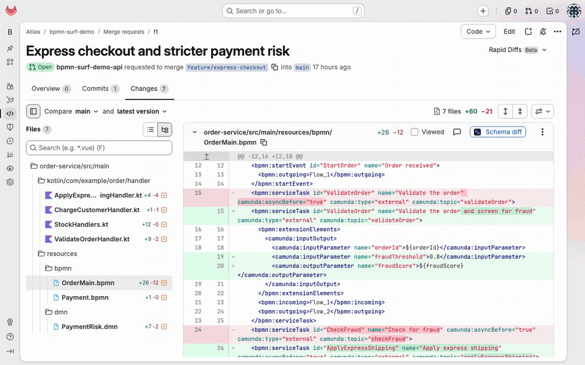
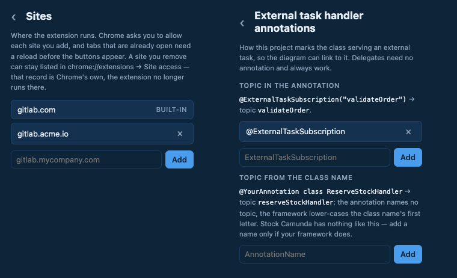
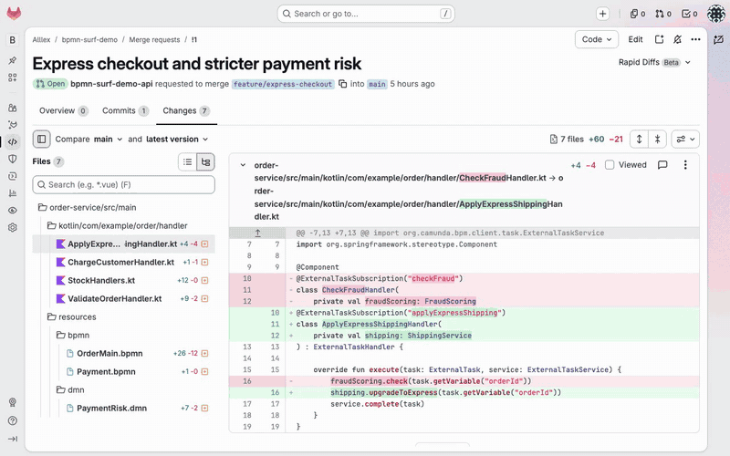
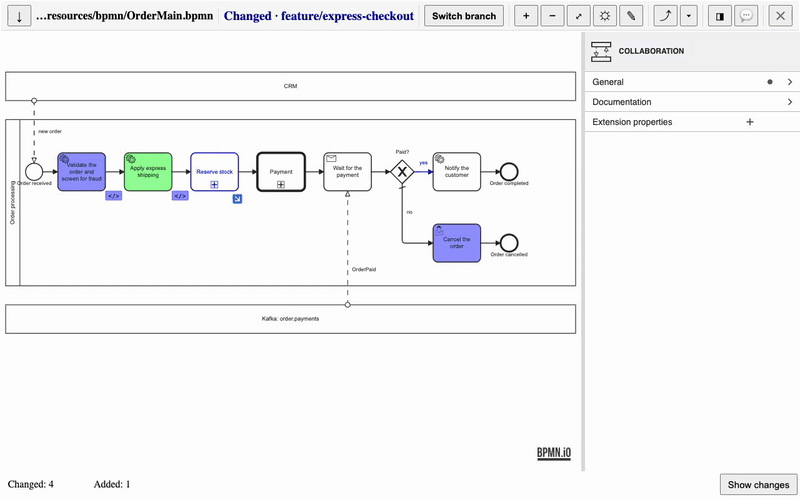
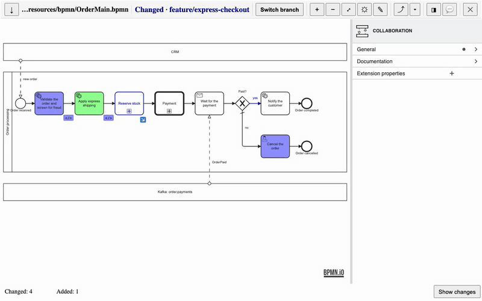
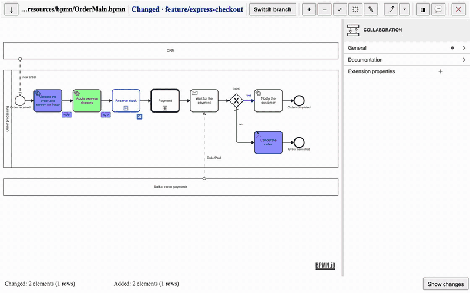
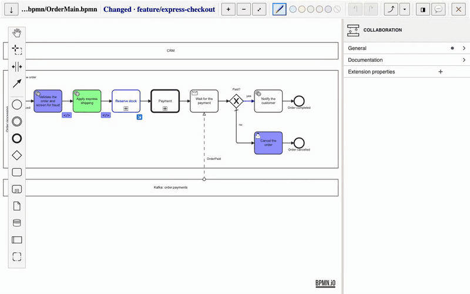
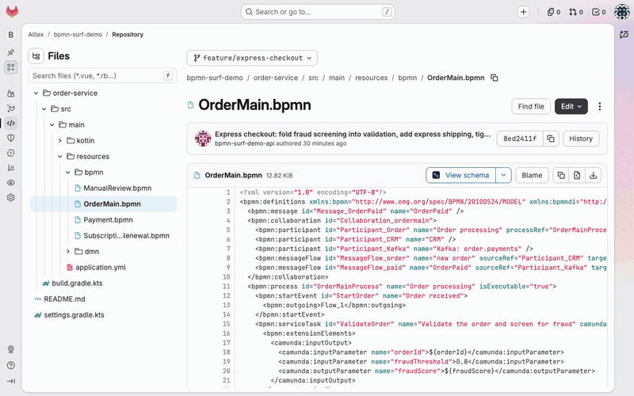

# bpmn-surf

Browser extension for viewing and comparing BPMN and DMN diagrams: open schemas straight from a repository, follow call activities and decision references across files (and back), and review changes in GitLab merge requests and GitHub pull requests.

Try it on the public [demo merge request](https://gitlab.com/kao.alllex/bpmn-surf-demo/-/merge_requests/1)
once the extension is [installed](#installation). The diffs, diving into called processes and a changed
handler's diff work signed out. Jumping to an unchanged handler's code, to message
correlation and to a called decision, and listing the callers of a diagram, use GitLab code
search, which on gitlab.com needs a signed-in account.

## Requirements

- Google Chrome
- Other Chromium browsers with support for Chrome Extension Manifest V3

## Installation

Install **bpmn-surf** from the [Chrome Web Store](https://chromewebstore.google.com/detail/bpmn-surf/baaoelmjlbfjhhkgbfkilgnefegbaldp) — Chrome keeps it up to date.

### From source

The extension has no build step — it runs directly from the source files.

1. Get the sources: `git clone https://github.com/kaoalllex/bpmn-surf.git`, or **Code → Download ZIP** on GitHub and unzip
2. Open the extensions page: `chrome://extensions`
3. Enable **Developer mode** (toggle in the top-right corner)
4. Click **Load unpacked** and select the `bpmn-surf` folder

To update, pull (or re-download) the sources and click ⟳ on the extension in `chrome://extensions`.

### Turning on your sites

Nothing is on by default: the extension runs only on the sites you add, so it asks
for no access to pages you never review diagrams on. Add `gitlab.com`, `github.com` or
your own GitLab from the extension popup — no file editing:

1. Click the bpmn-surf icon in the browser toolbar (it shows `!` while no site is on)
2. Under **Sites**, type the host (`github.com`, `gitlab.com`, `gitlab.mycompany.com`; a
   pasted merge or pull request link works too) and click **Add**
3. Confirm the access request Chrome shows
4. Reload the tabs you already had open

If you updated from 1.3 and the buttons are gone from `gitlab.com`, the popup offers
**Turn on gitlab.com**. A build made for a team can bake its hosts in, so they need no
popup step (`npm run package -- gitlab.internal.example`).

Only `https` hosts are accepted. The host is kept as a Chrome permission, so it survives
updates and re-installs; remove it with the `×` next to it in the popup. Chrome may keep
showing a removed host under `chrome://extensions` → Details → Site access — that record is
its own, the extension no longer runs there.

The same popup sets which annotations mark external-task handlers, if your project uses
something other than `@ExternalTaskSubscription`.

## Features

The buttons appear only where there is a diagram: on `.bpmn` and `.dmn` files in a merge
request, and on a diagram file in the repository. On GitHub the same buttons sit on the
**Files changed** tab of a pull request (public and private, signed in or out) and on a
file page; navigation (diving into called processes, callers, handlers) works without a token: GitHub's own default-branch code search plus the pull request's own files; signed out, only the PR's files. The commit and range pickers of a pull request are followed. GitHub Enterprise Server is supported by design: add the site like a self-managed GitLab; it is recognised from its pages, or pick its type (GitLab or GitHub) next to the site in the popup (not yet tried on a real instance).

**Comparing changes**

- Visual diff of two BPMN/DMN versions in a merge request (MR branch vs. target branch), opened from a **Schema diff** / **Decision diff** button that appears on the MR page
- Diff of a selected MR commit against its parent
- Diff of a repository file against a local version (**Diff with local file…** in the menu of the **View schema** button)
- Highlighting changes: 🟩 added, 🟥 removed, 🟦 modified — with a ☼ toggle to turn it off
- Switching between the shown versions (the **Switch branch** button) — the target branch is shown by name, not by hash — and downloading either of them
- A clear indication when a schema is absent in one of the versions
- A list of the changes — elements and connections, with what changed in each; click an entry to jump to its element. The list follows the level on screen: a collapsed subprocess with changes inside is one entry, and the list inside it shows its own changes
- Highlighting of the properties-panel groups affected by a change; an element whose type changed is marked in the panel header
- Inside an element, highlighting the specific changed In/Out mapping and Input/Output entries, and the changed lines of a sequence-flow condition
- A collapsed subprocess is outlined when something inside it changed

**Browsing & navigation**

- Viewing a BPMN schema or DMN decision from a repository file, without a diff — opened from a **View schema** / **View decision** button next to the file name
- A clickable file path in the header (opens the file in the repository)
- Diving from a Call Activity into the called process — and stepping back to the caller
- A menu of every diagram that calls the one on screen
- Navigating from a Business Rule Task to the called DMN — and back
- Jumping to the handler code of a service task (external task or delegate) — to its diff when the merge request changed it
- Jumping from a message-catching event/task to where its message is correlated in code

**Reading a diagram**

- A properties panel with element details, including readable sequence-flow conditions
- The properties panel auto-expands the groups relevant to the selected element, and can be resized or hidden
- Searching for an element on the canvas (Ctrl/Cmd+F)
- Viewport controls: zoom/pan and **Fit view**

**Editing a BPMN schema**

- Opening the schema currently on screen in an **edit mode** (the **✎** button) — in a separate tab; nothing is ever written back to the repository
- Canvas editing: palette, context pad, undo/redo — plus an editable properties panel (names, implementation, topics, conditions, In/Out mappings, Inputs/Outputs)
- Edits are coloured against the version you started from (🟩 added, 🟦 changed), with a toggle to turn the colouring off, and manual colours for individual elements
- Downloading the result as a single `.bpmn` file

To review your edits before committing them, open the diagram's file in the repository,
pick **Diff with local file…** in the menu of the **View schema** button and choose the
downloaded file: the edits show up as an ordinary diff against the branch.

## Links

- [Issues](https://github.com/kaoalllex/bpmn-surf/issues) — bug reports and feature requests
- [Privacy policy](PRIVACY.md) — what the extension reads, stores and sends

## Licence

MIT — see [LICENSE](LICENSE).
